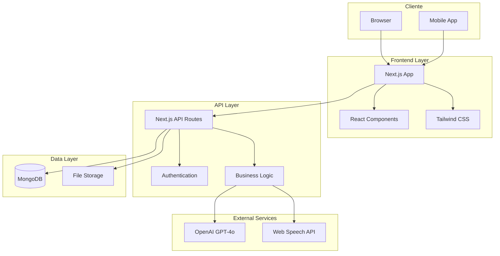
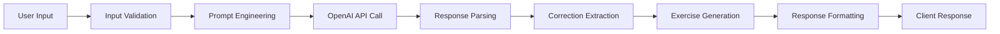

# 🏗️ Arquitetura do Sistema

## 🎯 Visão Geral

O AI Linguo foi desenvolvido com uma arquitetura moderna e escalável, utilizando as melhores práticas de desenvolvimento full-stack e integrando inteligência artificial de forma eficiente.

---

## 🏛️ Arquitetura de Alto Nível



---

## 🎨 Frontend Architecture

### 📱 **Next.js App Router**
```
app/
├── page.js                 # Aplicação principal (SPA)
├── layout.js              # Root layout
├── globals.css            # Estilos globais
└── api/                   # API routes
    ├── auth/              # Autenticação
    ├── tutor/             # IA conversacional
    ├── chat/              # Gestão de sessões
    └── vocabulary/        # Sistema SRS
```

### 🧩 **Component Architecture**
```javascript
// Hierarquia de componentes
<AiLinguoApp>
  ├── <LandingPage>
  │   ├── <HeroSection>
  │   ├── <FeatureCards>
  │   └── <AuthModal>
  ├── <Dashboard>
  │   ├── <ProgressCards>
  │   ├── <ActivityGrid>
  │   └── <RecommendedLesson>
  ├── <ChatInterface>
  │   ├── <MessageList>
  │   ├── <CorrectionDisplay>
  │   └── <MessageInput>
  └── <VocabularyPractice>
      ├── <Flashcard>
      ├── <DifficultyButtons>
      └── <ProgressIndicator>
```

### 🎨 **Design System**
```css
/* Tokens de design */
:root {
  /* Spacing */
  --space-xs: 0.25rem;
  --space-sm: 0.5rem;
  --space-md: 1rem;
  --space-lg: 1.5rem;
  --space-xl: 2rem;
  
  /* Typography */
  --font-size-sm: 0.875rem;
  --font-size-base: 1rem;
  --font-size-lg: 1.125rem;
  --font-size-xl: 1.25rem;
  
  /* Colors */
  --primary: 220 100% 50%;
  --secondary: 270 100% 50%;
  --success: 142 76% 36%;
  --warning: 38 92% 50%;
  --error: 0 84% 60%;
}
```

---

## 🔌 Backend Architecture

### 🛣️ **API Routes Structure**
```
/api
├── /auth
│   ├── /login             POST: User authentication
│   └── /register          POST: User registration
├── /tutor                 POST: AI conversation
├── /chat
│   ├── /sessions          POST: Create session
│   └── /history           GET: Chat history
├── /vocabulary
│   ├── /due               GET: Due cards
│   └── /review            POST: Card review
├── /lessons               GET: Lessons by level
├── /pronunciation         POST: Audio analysis
└── /user
    ├── /profile           GET: User data
    └── /progress          POST: Update progress
```

### 🔄 **Request/Response Flow**
```javascript
// Exemplo: Chat com IA
const handleTutorRequest = async (req, res) => {
  // 1. Validação de entrada
  const { userText, userLevel, sessionId } = req.body;
  
  // 2. Verificação de autenticação
  const user = await validateUser(req.headers.authorization);
  
  // 3. Processamento de negócio
  if (AI_TUTOR_MOCK === '1') {
    response = getMockResponse(userText, userLevel);
  } else {
    response = await callOpenAI(userText, userLevel);
  }
  
  // 4. Persistência
  await saveChatTurn(sessionId, 'user', userText);
  await saveChatTurn(sessionId, 'assistant', response);
  
  // 5. Resposta
  return res.json(response);
};
```

---

## 🗄️ Data Architecture

### 📊 **MongoDB Schema Design**

#### **Users Collection**
```javascript
{
  _id: "uuid",
  email: "string", // unique index
  name: "string",
  password: "string", // bcrypt hash
  cefrLevel: "enum[A1,A2,B1,B2,C1]",
  dailyGoalMinutes: "number",
  createdAt: "date",
  updatedAt: "date",
  
  // Computed fields
  streakDays: "number",
  totalMinutes: "number",
  lastStudyDate: "date"
}
```

#### **Chat Sessions**
```javascript
{
  _id: "uuid",
  userId: "uuid", // foreign key
  level: "string",
  topic: "string", 
  createdAt: "date",
  summary: "string", // AI-generated summary
  
  // Metadata
  messageCount: "number",
  duration: "number", // seconds
  corrections: "number" // total corrections made
}
```

#### **SRS Reviews**
```javascript
{
  _id: "uuid",
  userId: "uuid",
  cardId: "uuid",
  
  // SRS Algorithm fields
  dueAt: "date", // when to review next
  interval: "number", // days between reviews
  ease: "number", // easiness factor (1.3-2.5)
  repetitions: "number", // how many times reviewed
  
  lastResult: "enum[again,hard,good,easy]",
  reviewedAt: "date"
}
```

### 🔍 **Indexing Strategy**
```javascript
// Performance-critical indexes
db.users.createIndex({ email: 1 }, { unique: true });
db.chatSessions.createIndex({ userId: 1, createdAt: -1 });
db.srsReviews.createIndex({ userId: 1, dueAt: 1 });
db.chatTurns.createIndex({ sessionId: 1, createdAt: 1 });

// Compound indexes for common queries
db.srsReviews.createIndex({ userId: 1, dueAt: 1, cardId: 1 });
db.vocabCards.createIndex({ cefrLevel: 1, term: 1 });
```

---

## 🤖 AI Integration Architecture

### 🧠 **OpenAI Integration**
```javascript
// Configuração otimizada
const openai = new OpenAI({
  apiKey: process.env.OPENAI_API_KEY,
  timeout: 30000, // 30s timeout
  maxRetries: 3,
});

// Sistema de prompts estruturado
const createTutorPrompt = (userLevel, context) => {
  const basePrompt = `You are an English tutor for Brazilian Portuguese speakers.`;
  
  const levelAdaptation = {
    A1: 'Use simple vocabulary, basic sentences, focus on present tense.',
    A2: 'Include past/future tense, common adjectives, basic connectors.',
    B1: 'Use conditionals, passive voice, complex sentences.',
    B2: 'Include advanced grammar, idiomatic expressions.',
    C1: 'Use sophisticated vocabulary, nuanced explanations.'
  };
  
  return `${basePrompt}\n\nUser Level: ${userLevel}\nAdaptation: ${levelAdaptation[userLevel]}\n\nContext: ${context}`;
};
```

### 🔄 **Response Processing Pipeline**


### 💾 **Caching Strategy**
```javascript
// Cache de respostas para otimizar custos
const getCachedResponse = async (userText, userLevel) => {
  const cacheKey = `response:${hash(userText)}:${userLevel}`;
  
  let response = await redis.get(cacheKey);
  if (!response) {
    response = await callOpenAI(userText, userLevel);
    await redis.set(cacheKey, response, 'EX', 3600); // 1 hour TTL
  }
  
  return response;
};
```

---

## 🔐 Security Architecture

### 🛡️ **Authentication & Authorization**
```javascript
// JWT-based authentication
const generateToken = (user) => {
  return jwt.sign(
    { 
      userId: user._id,
      email: user.email,
      role: user.role 
    },
    process.env.JWT_SECRET,
    { 
      expiresIn: '24h',
      issuer: 'ai-linguo',
      audience: 'ai-linguo-users'
    }
  );
};

// Middleware de autenticação
const authenticateToken = (req, res, next) => {
  const authHeader = req.headers['authorization'];
  const token = authHeader && authHeader.split(' ')[1];
  
  if (!token) {
    return res.status(401).json({ error: 'Access token required' });
  }
  
  jwt.verify(token, process.env.JWT_SECRET, (err, user) => {
    if (err) return res.status(403).json({ error: 'Invalid token' });
    req.user = user;
    next();
  });
};
```

### 🔒 **Data Protection**
```javascript
// Sanitização de inputs
const sanitizeInput = (input) => {
  return DOMPurify.sanitize(input, {
    ALLOWED_TAGS: [],
    ALLOWED_ATTR: []
  });
};

// Rate limiting
const rateLimiter = rateLimit({
  windowMs: 15 * 60 * 1000, // 15 minutes
  max: 100, // limit each IP to 100 requests per windowMs
  message: 'Too many requests from this IP',
  standardHeaders: true,
  legacyHeaders: false,
});
```

---

## 🚀 Performance Architecture

### ⚡ **Frontend Optimizations**
```javascript
// Code splitting por rota
const Dashboard = lazy(() => import('./components/Dashboard'));
const ChatInterface = lazy(() => import('./components/ChatInterface'));

// Memoização de componentes caros
const ExpensiveComponent = memo(({ data }) => {
  const processedData = useMemo(() => {
    return heavyComputation(data);
  }, [data]);
  
  return <div>{processedData}</div>;
});

// Lazy loading de imagens
<Image
  src="/hero-image.jpg"
  alt="AI Linguo"
  loading="lazy"
  placeholder="blur"
/>
```

### 🗄️ **Backend Optimizations**
```javascript
// Connection pooling para MongoDB
const client = new MongoClient(uri, {
  maxPoolSize: 20,
  minPoolSize: 5,
  maxIdleTimeMS: 30000,
  serverSelectionTimeoutMS: 5000,
});

// Agregação otimizada para métricas
const getUserStats = async (userId) => {
  return db.collection('chatTurns').aggregate([
    { $match: { userId: ObjectId(userId) } },
    {
      $group: {
        _id: null,
        totalMessages: { $sum: 1 },
        avgCorrections: { $avg: '$correctionsCount' },
        studyTime: { $sum: '$duration' }
      }
    }
  ]).toArray();
};
```

---

## 🐳 Deployment Architecture

### 📦 **Containerization**
```dockerfile
# Multi-stage build para otimização
FROM node:18-alpine AS deps
WORKDIR /app
COPY package*.json ./
RUN yarn install --frozen-lockfile --production

FROM node:18-alpine AS builder
WORKDIR /app
COPY --from=deps /app/node_modules ./node_modules
COPY . .
RUN yarn build

FROM node:18-alpine AS runner
WORKDIR /app
RUN addgroup --system --gid 1001 nodejs
RUN adduser --system --uid 1001 nextjs

COPY --from=builder --chown=nextjs:nodejs /app/.next ./.next
COPY --from=builder /app/node_modules ./node_modules
COPY --from=builder /app/package.json ./package.json

USER nextjs
EXPOSE 3000
CMD ["yarn", "start"]
```

### 🔄 **Docker Compose Setup**
```yaml
version: '3.8'

services:
  app:
    build: .
    ports:
      - "3000:3000"
    environment:
      - MONGODB_URI=mongodb://mongo:27017/ailinguo
      - AI_TUTOR_MOCK=1
    depends_on:
      - mongo
      - redis
    restart: unless-stopped
    
  mongo:
    image: mongo:7
    ports:
      - "27017:27017"
    volumes:
      - mongo_data:/data/db
    restart: unless-stopped
    
  redis:
    image: redis:7-alpine
    ports:
      - "6379:6379"
    volumes:
      - redis_data:/data
    restart: unless-stopped

volumes:
  mongo_data:
  redis_data:
```

---

## 📊 Monitoring Architecture

### 📈 **Application Metrics**
```javascript
// Custom metrics collection
const metrics = {
  // Performance
  httpRequestDuration: new prometheus.Histogram({
    name: 'http_request_duration_seconds',
    help: 'Duration of HTTP requests in seconds',
    labelNames: ['method', 'route', 'status']
  }),
  
  // Business metrics
  chatMessages: new prometheus.Counter({
    name: 'chat_messages_total',
    help: 'Total number of chat messages',
    labelNames: ['user_level', 'correction_count']
  }),
  
  // Error tracking
  errorRate: new prometheus.Counter({
    name: 'errors_total',
    help: 'Total number of errors',
    labelNames: ['type', 'severity']
  })
};

// Middleware para coleta automática
app.use((req, res, next) => {
  const start = Date.now();
  
  res.on('finish', () => {
    const duration = (Date.now() - start) / 1000;
    metrics.httpRequestDuration
      .labels(req.method, req.route?.path || req.path, res.statusCode)
      .observe(duration);
  });
  
  next();
});
```

### 🚨 **Health Checks**
```javascript
// Health check endpoint
app.get('/health', async (req, res) => {
  const checks = {
    timestamp: new Date().toISOString(),
    uptime: process.uptime(),
    status: 'ok',
    services: {}
  };
  
  try {
    // Database health
    await db.admin().ping();
    checks.services.database = 'healthy';
    
    // Redis health
    await redis.ping();
    checks.services.redis = 'healthy';
    
    // OpenAI health (optional)
    if (process.env.OPENAI_API_KEY) {
      await openai.models.list();
      checks.services.openai = 'healthy';
    }
    
    res.status(200).json(checks);
  } catch (error) {
    checks.status = 'error';
    checks.error = error.message;
    res.status(503).json(checks);
  }
});
```

---

## 🔮 Scalability Considerations

### 📈 **Horizontal Scaling**
```yaml
# Kubernetes deployment example
apiVersion: apps/v1
kind: Deployment
metadata:
  name: ai-linguo-app
spec:
  replicas: 3
  selector:
    matchLabels:
      app: ai-linguo
  template:
    metadata:
      labels:
        app: ai-linguo
    spec:
      containers:
      - name: app
        image: ai-linguo:latest
        ports:
        - containerPort: 3000
        env:
        - name: MONGODB_URI
          valueFrom:
            secretKeyRef:
              name: ai-linguo-secrets
              key: mongodb-uri
        resources:
          requests:
            memory: "256Mi"
            cpu: "250m"
          limits:
            memory: "512Mi"
            cpu: "500m"
```

### 🗄️ **Database Scaling**
```javascript
// MongoDB replica set configuration
rs.initiate({
  _id: "ai-linguo-rs",
  members: [
    { _id: 0, host: "mongo1:27017", priority: 2 },
    { _id: 1, host: "mongo2:27017", priority: 1 },
    { _id: 2, host: "mongo3:27017", arbiterOnly: true }
  ]
});

// Read preference para distribuir carga
const client = new MongoClient(uri, {
  readPreference: 'secondaryPreferred',
  readConcern: { level: 'majority' }
});
```

Esta arquitetura robusta garante escalabilidade, performance e maintibilidade para o crescimento futuro da aplicação.