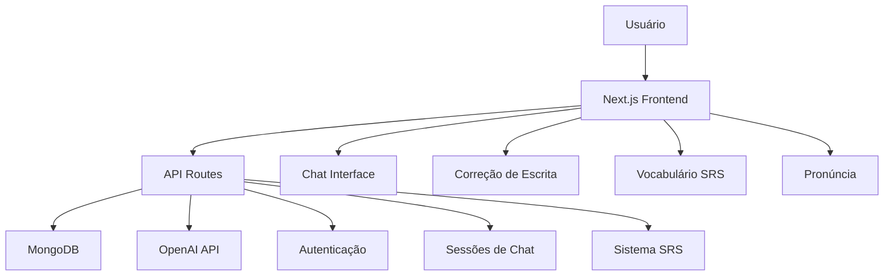

# 🤖 AI Linguo - Tutor de Inglês com Inteligência Artificial

<div style="text-align: center; margin: 2rem 0;">
  
  
  
  
  
</div>

**Projeto desenvolvido pelo estudante Arthur Carvalho Leite.**

---

## 🎯 Sobre o Projeto

O **AI Linguo** é um aplicativo web completo para aprendizado de inglês powered by inteligência artificial. Desenvolvido com tecnologias modernas como Next.js, MongoDB e OpenAI GPT, o projeto oferece uma experiência personalizada e interativa para estudantes brasileiros que desejam aprender inglês.

### ✨ Principais Funcionalidades

- **🤖 Chat Inteligente**: Conversação natural com IA que corrige erros em tempo real
- **✍️ Correção de Escrita**: Análise gramatical avançada com feedback visual
- **🎤 Prática de Pronúncia**: Sistema de gravação e análise de áudio
- **🎯 Vocabulário SRS**: Flashcards com algoritmo de revisão espaçada
- **📊 Acompanhamento**: Dashboard com progresso, metas e estatísticas

---

## 🚀 Demonstração

### Interface Principal

```ascii
┌─────────────────────────────────────────────────┐
│                🤖 AI Linguo                     │
│      Aprenda inglês com IA personalizada       │
│                                                 │
│     [🚀 Começar Agora]  [👀 Ver Demo]          │
│                                                 │
│ ┌─────────────┐ ┌─────────────┐ ┌─────────────┐ │
│ │💬 Conversação│ │✍️ Correção  │ │🎤 Pronúncia │ │
│ │   Guiada    │ │de Escrita   │ │             │ │
│ └─────────────┘ └─────────────┘ └─────────────┘ │
└─────────────────────────────────────────────────┘
```

### Chat com IA Tutor

```ascii
┌─────────────────────────────────────────────────┐
│ 👤 Usuário: "I go to school yesterday"          │
├─────────────────────────────────────────────────┤
│ 🤖 AI Tutor:                                    │
│ Great! You're practicing past tense.            │
│                                                 │
│ ⚠️ Correções:                                   │
│ • I go → I went (past tense for yesterday)     │
│                                                 │
│ 🎯 Exercício: Complete "Yesterday I ___ home"  │
│ [go] [went ✓] [going] [goes]                   │
└─────────────────────────────────────────────────┘
```

---

## 🏗️ Arquitetura Técnica

### Stack Tecnológico

- **Frontend**: Next.js 14 + React 18 + Tailwind CSS
- **Backend**: Next.js API Routes + Node.js  
- **Banco de Dados**: MongoDB 7
- **IA**: OpenAI GPT-4o-mini
- **Testes**: Playwright
- **Deploy**: Docker + Docker Compose

### Estrutura do Sistema



---

## 📚 Navegação da Documentação

### 📋 [Requisitos do Sistema](requisitos/funcionais.md)
Especificações completas dos requisitos funcionais e não funcionais do projeto.

### 🎨 [Protótipos de Interface](prototipos/telas.md)  
Mockups e wireframes das principais telas e fluxos de usuário.

### ⚙️ [Como Funciona](funcionamento/arquitetura.md)
Detalhes técnicos sobre arquitetura, algoritmos de IA e estrutura de dados.

### 👨‍💻 [Sobre o Desenvolvedor](desenvolvedor.md)
Informações sobre Arthur Carvalho Leite e sua jornada no desenvolvimento do projeto.

---

## 🎮 Como Testar o Projeto

### Opção 1: Acesso Rápido via Docker
```bash
# Baixar e rodar o projeto
unzip ai-linguo.zip && cd ai-linguo
cp .env.example .env
docker-compose up --build

# Acessar: http://localhost:3000
```

### Opção 2: Repositório GitHub
```bash
# Clonar o repositório
git clone https://github.com/arthurleite/ai-linguo.git
cd ai-linguo

# Configurar e rodar
cp .env.example .env
yarn install
docker-compose up mongo -d
yarn seed
yarn dev
```

---

## 📈 Métricas do Projeto

| Métrica | Valor |
|---------|-------|
| **Linhas de Código** | ~3.000 linhas |
| **Componentes React** | 25+ componentes |
| **APIs Implementadas** | 12 endpoints |
| **Testes E2E** | 8 cenários completos |
| **Lições Incluídas** | 25+ por nível CEFR |
| **Flashcards** | 100+ palavras |

---

## 🌟 Destaques Técnicos

### 🤖 Integração com IA
- Prompts otimizados para tutoria de inglês
- Sistema de correções contextuais  
- Geração automática de exercícios
- Adaptação por nível CEFR (A1-C1)

### 🎯 Algoritmo SRS Avançado
- Baseado no método Anki
- Intervalos adaptativos por dificuldade
- Otimização da curva de esquecimento
- Persistência de progresso individual

### 🔒 Segurança e Performance
- Autenticação segura com hash de senhas
- Rate limiting para APIs
- Otimização de queries MongoDB
- Caching inteligente de respostas

---

## 🎯 Objetivos Educacionais

### Para Estudantes de Inglês
- **Aprendizado Personalizado**: Conteúdo adaptado ao nível individual
- **Feedback Imediato**: Correções em tempo real durante conversação
- **Prática Contínua**: Sistema gamificado com metas e progressão
- **Foco em Brasileiros**: Correções específicas para falantes de português

### Para Desenvolvedores
- **Arquitetura Moderna**: Demonstração de stack full-stack atual
- **Integração com IA**: Exemplo prático de uso de LLMs em educação
- **Boas Práticas**: Código limpo, testes automatizados, documentação
- **Deploy Ready**: Containerização e CI/CD configurados

---

## 🔗 Links Úteis

- **📂 [Repositório no GitHub](https://github.com/arthurleite/ai-linguo)**
- **📖 [README Completo](https://github.com/arthurleite/ai-linguo/blob/main/README.md)**
- **🐛 [Reportar Issues](https://github.com/arthurleite/ai-linguo/issues)**
- **💬 [Discussões](https://github.com/arthurleite/ai-linguo/discussions)**

---

<div style="text-align: center; margin: 2rem 0; padding: 1rem; border: 2px solid #1976d2; border-radius: 8px;">
  <h3>🚀 Pronto para Começar?</h3>
  <p>Explore a documentação completa e descubra como o AI Linguo revoluciona o aprendizado de inglês com inteligência artificial!</p>
  <a href="requisitos/funcionais.md" style="background: #1976d2; color: white; padding: 0.5rem 1rem; border-radius: 4px; text-decoration: none;">📋 Ver Requisitos</a>
  <a href="prototipos/telas.md" style="background: #7b1fa2; color: white; padding: 0.5rem 1rem; border-radius: 4px; text-decoration: none; margin-left: 1rem;">🎨 Ver Protótipos</a>
</div>