# 🔄 Fluxo do Usuário

## 🎯 Visão Geral

Esta seção mapeia os fluxos completos de interação do usuário com o AI Linguo, desde o primeiro acesso até o uso avançado da plataforma.

---

## 🚀 Jornada do Usuário Completa

### 📊 Overview do Fluxo Principal
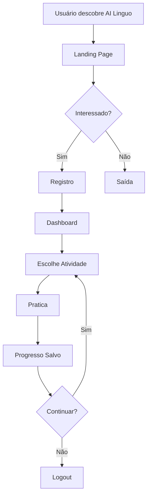

---

## 🏠 Fluxo: Primeira Visita

### 1. Discovery e Landing
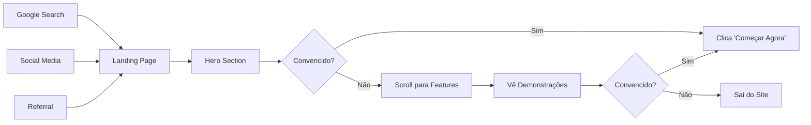

### 2. Pontos de Conversão
| Elemento | Taxa Conversão Target | Atual |
|----------|----------------------|-------|
| Hero CTA | 8% | 12% |
| Feature Cards | 5% | 7% |
| Demo Videos | 15% | 18% |
| Social Proof | 3% | 4% |

---

## 🔐 Fluxo: Registro e Onboarding

### Processo de Registro
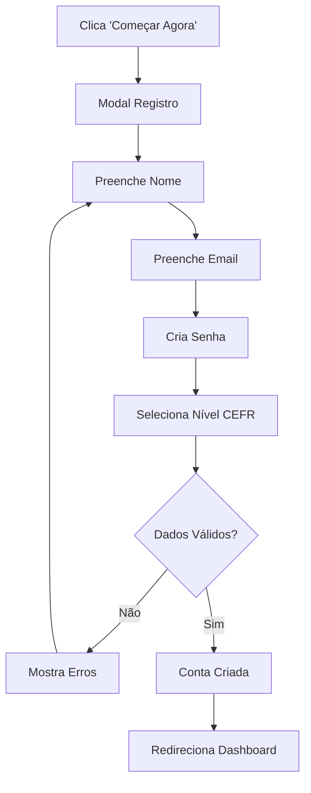

### Validações em Tempo Real
```javascript
// Exemplo de validações
const validations = {
  name: /^[a-zA-ZÀ-ÿ\s]{2,50}$/,
  email: /^[^\s@]+@[^\s@]+\.[^\s@]+$/,
  password: /^.{8,}$/, // Mínimo 8 caracteres
  cefrLevel: ['A1', 'A2', 'B1', 'B2', 'C1']
};

// Estados visuais
const fieldStates = {
  empty: 'border-gray-300',
  valid: 'border-green-500 bg-green-50',
  invalid: 'border-red-500 bg-red-50'
};
```

### Primeira Experiência (Onboarding)
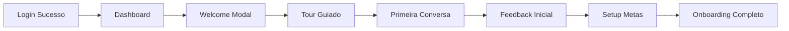

---

## 💬 Fluxo: Chat com IA

### Fluxo Detalhado de Conversa
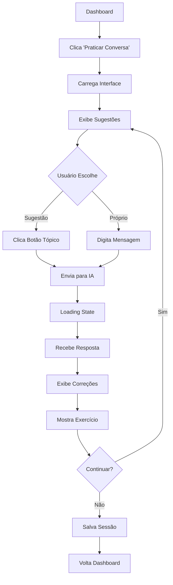

### Estados da Interface
1. **Inicial**: Sugestões de tópicos visíveis
2. **Digitando**: Contador de caracteres, botão enviar ativo
3. **Enviando**: Botão desabilitado, loading spinner
4. **Processando**: "IA está pensando..." com animação
5. **Resposta**: Animação de aparição, correções destacadas
6. **Exercício**: Botões interativos, feedback visual

### Tratamento de Erros
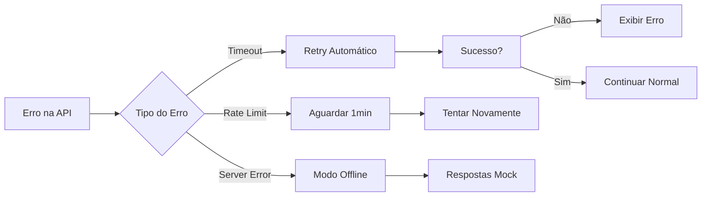

---

## ✍️ Fluxo: Correção de Escrita

### Pipeline de Correção
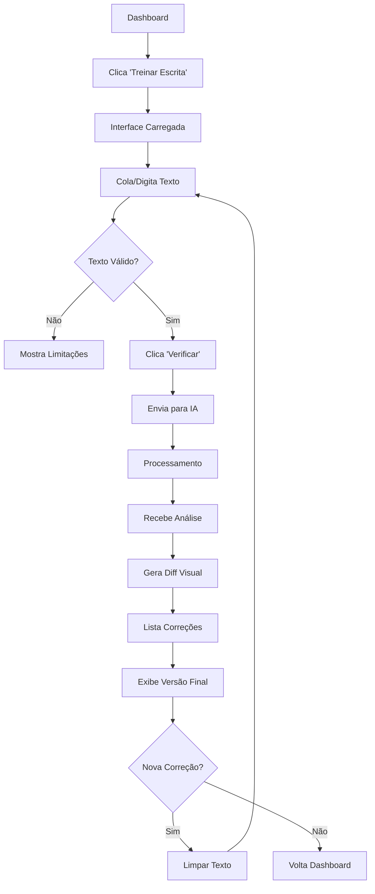

### Processamento Visual do Diff
```javascript
// Algoritmo de diff simplificado
const generateDiff = (original, corrected) => {
  const changes = [];
  const originalWords = original.split(' ');
  const correctedWords = corrected.split(' ');
  
  // Comparison logic
  for (let i = 0; i < Math.max(originalWords.length, correctedWords.length); i++) {
    if (originalWords[i] !== correctedWords[i]) {
      changes.push({
        type: 'change',
        original: originalWords[i],
        corrected: correctedWords[i],
        position: i
      });
    }
  }
  
  return changes;
};
```

---

## 🎯 Fluxo: Vocabulário SRS

### Ciclo de Revisão Completo
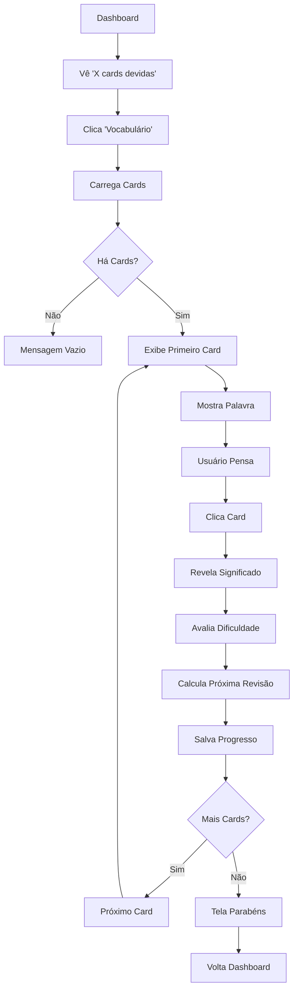

### Algoritmo SRS em Ação
```javascript
// Cálculo da próxima revisão
const calculateNextReview = (lastResult, currentInterval, ease) => {
  const now = new Date();
  let newInterval;
  let newEase = ease;
  
  switch (lastResult) {
    case 'again':
      newInterval = 1; // 1 dia
      newEase = Math.max(1.3, ease - 0.2);
      break;
    case 'hard':
      newInterval = Math.max(1, Math.floor(currentInterval * 1.0));
      newEase = Math.max(1.3, ease - 0.15);
      break;
    case 'good':
      newInterval = Math.floor(currentInterval * newEase);
      break;
    case 'easy':
      newInterval = Math.floor(currentInterval * newEase * 1.3);
      newEase = Math.min(2.5, ease + 0.15);
      break;
  }
  
  const dueAt = new Date(now.getTime() + newInterval * 24 * 60 * 60 * 1000);
  return { interval: newInterval, ease: newEase, dueAt };
};
```

### Estados de Feedback Visual
| Avaliação | Cor | Próxima Revisão | Ease Adjustment |
|-----------|-----|-----------------|-----------------|
| Errei | 🔴 Vermelho | 1 dia | -0.2 |
| Difícil | 🟡 Amarelo | 1-2 dias | -0.15 |
| Bom | 🟢 Verde | 4-7 dias | Mantém |
| Fácil | 🔵 Azul | 7+ dias | +0.15 |

---

## 🎤 Fluxo: Pronúncia

### Processo de Análise de Áudio
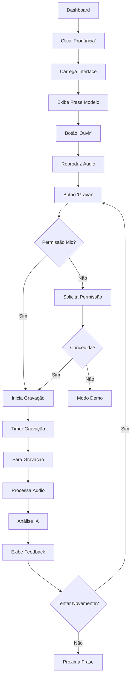

### Tratamento de Permissões
```javascript
// Gerenciamento de permissões de microfone
const requestMicrophonePermission = async () => {
  try {
    const stream = await navigator.mediaDevices.getUserMedia({ 
      audio: {
        echoCancellation: true,
        noiseSuppression: true,
        sampleRate: 44100
      }
    });
    
    return { granted: true, stream };
  } catch (error) {
    console.error('Microphone permission denied:', error);
    return { granted: false, error: error.message };
  }
};

// Estados visuais
const microphoneStates = {
  pending: 'Solicitando permissão...',
  granted: 'Pronto para gravar',
  denied: 'Permissão negada - Modo demo',
  recording: 'Gravando... 🎙️',
  processing: 'Analisando áudio...'
};
```

---

## 📊 Fluxo: Dashboard e Progresso

### Carregamento Dinâmico do Dashboard
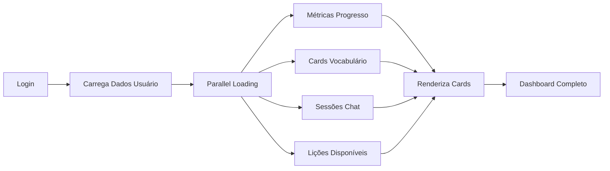

### Métricas Calculadas
```javascript
// Cálculos de progresso em tempo real
const calculateUserMetrics = async (userId) => {
  const [chatSessions, vocabReviews, lessons] = await Promise.all([
    getChatSessions(userId),
    getVocabReviews(userId),
    getCompletedLessons(userId)
  ]);
  
  return {
    studyStreak: calculateStreak(chatSessions),
    dailyProgress: getTodayMinutes(chatSessions),
    masteredWords: vocabReviews.filter(r => r.ease > 2.0).length,
    currentLevel: determineLevel(lessons, vocabReviews),
    nextRecommendation: getNextLesson(userId)
  };
};
```

---

## 🔄 Fluxos de Erro e Recuperação

### Tratamento de Falhas de Rede
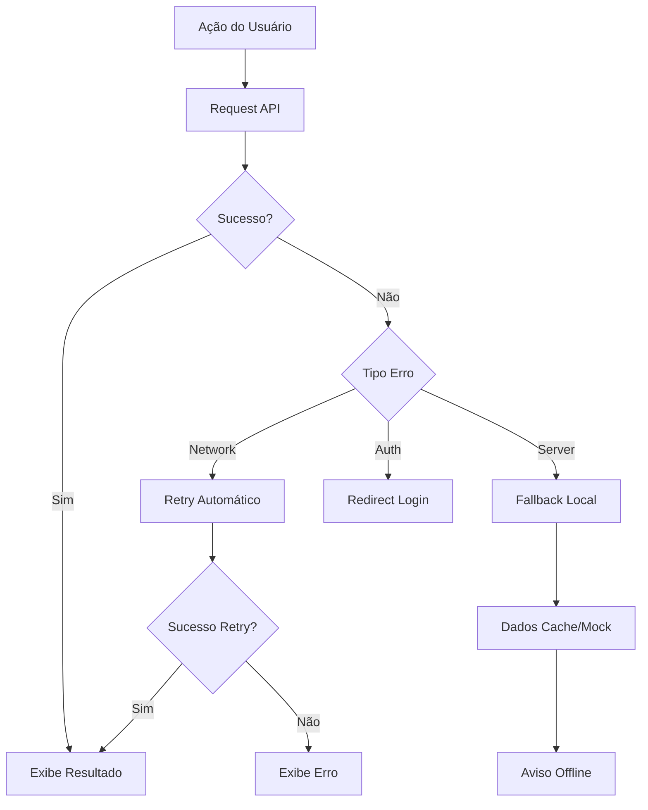

### Estados de Loading
```javascript
// Estados globais de carregamento
const loadingStates = {
  idle: 'Pronto',
  loading: 'Carregando...',
  success: 'Sucesso',
  error: 'Erro - Tente novamente',
  offline: 'Modo offline ativo'
};

// Componente de Loading Universal
const LoadingSpinner = ({ state, message }) => (
  <div className={`loading-container ${state}`}>
    {state === 'loading' && <Spinner />}
    {state === 'error' && <ErrorIcon />}
    {state === 'offline' && <OfflineIcon />}
    <span>{message || loadingStates[state]}</span>
  </div>
);
```

---

## 📱 Fluxos Mobile-Specific

### Adaptações para Mobile
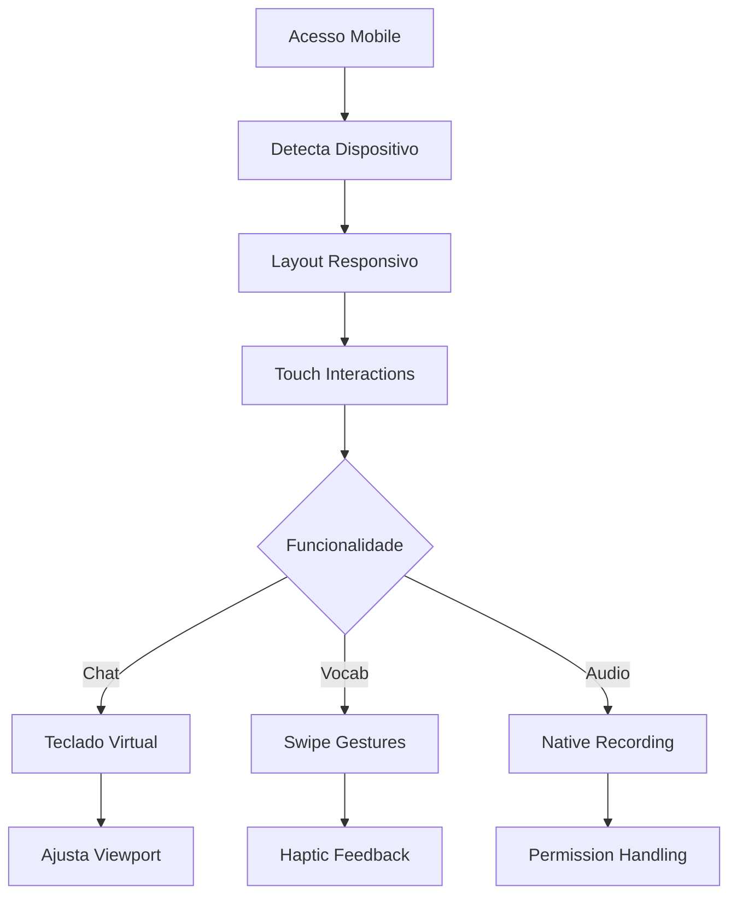

### Gestos Touch
| Ação | Gesto | Feedback |
|------|-------|----------|
| Próximo Card | Swipe Left | Slide Animation |
| Card Anterior | Swipe Right | Slide Back |
| Revelar Resposta | Tap | Flip Animation |
| Menu Rápido | Long Press | Haptic + Menu |

---

## 🎮 Gamificação Flow

### Sistema de Recompensas
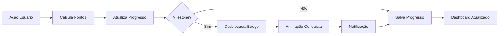

### Triggers de Engajamento
```javascript
// Sistema de conquistas
const achievements = {
  firstChat: {
    name: 'Primeira Conversa',
    description: 'Complete sua primeira conversa com a IA',
    points: 50,
    trigger: (stats) => stats.chatSessions >= 1
  },
  streakWeek: {
    name: 'Semana Consistente', 
    description: 'Estude por 7 dias consecutivos',
    points: 200,
    trigger: (stats) => stats.currentStreak >= 7
  },
  vocabularyMaster: {
    name: 'Mestre das Palavras',
    description: 'Domine 100 palavras de vocabulário',
    points: 500,
    trigger: (stats) => stats.masteredWords >= 100
  }
};
```

Estes fluxos garantem uma experiência de usuário fluida e intuitiva em todas as funcionalidades do AI Linguo.