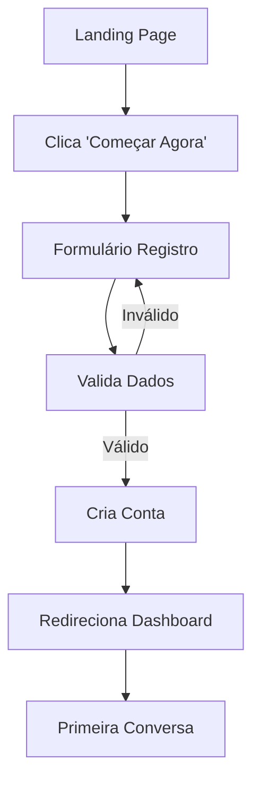
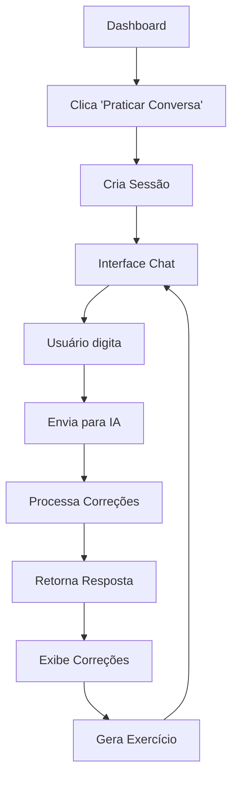
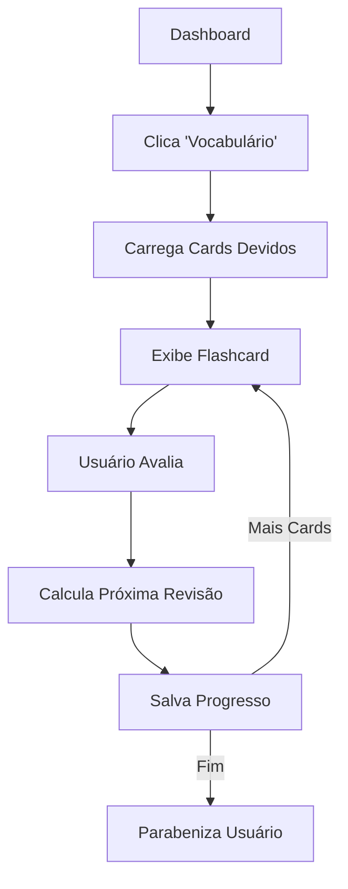

# 📋 Requisitos Funcionais

## 🎯 Visão Geral

Os requisitos funcionais do AI Linguo definem as funcionalidades específicas que o sistema deve implementar para atender às necessidades dos usuários que desejam aprender inglês com auxílio de inteligência artificial.

---

## 🔐 RF01 - Sistema de Autenticação

### Descrição
O sistema deve permitir que usuários se registrem e façam login de forma segura.

### Critérios de Aceitação
- [x] **RF01.1** - Registro com email, nome, senha e nível CEFR
- [x] **RF01.2** - Login com email e senha
- [x] **RF01.3** - Validação de campos obrigatórios
- [x] **RF01.4** - Hash seguro de senhas
- [x] **RF01.5** - Sessão persistente durante uso
- [x] **RF01.6** - Logout com limpeza de sessão

### Regras de Negócio
- Email deve ser único no sistema
- Senha deve ter mínimo 8 caracteres
- Nível CEFR deve ser selecionado durante registro (A1-C1)
- Tentativas de login inválidas são registradas

### Exemplo de Uso
```
DADO que um usuário acessa a página inicial
QUANDO clica em "Começar Agora"
E preenche formulário com dados válidos
ENTÃO o sistema cria a conta e redireciona para dashboard
```

---

## 🤖 RF02 - Chat Inteligente com IA

### Descrição
Conversação natural entre usuário e tutor IA com correções gramaticais em tempo real.

### Critérios de Aceitação
- [x] **RF02.1** - Interface de chat em tempo real
- [x] **RF02.2** - Integração com OpenAI GPT-4o-mini
- [x] **RF02.3** - Correções automáticas (máximo 3 por mensagem)
- [x] **RF02.4** - Explicações em português brasileiro
- [x] **RF02.5** - Geração de mini-exercícios contextuais
- [x] **RF02.6** - Adaptação por nível CEFR do usuário
- [x] **RF02.7** - Histórico de conversas persistente
- [x] **RF02.8** - Modo mock para testes sem API key

### Regras de Negócio
- IA responde sempre em inglês primeiro
- Correções são limitadas a 3 por resposta
- Exercícios baseados nos erros detectados
- Conversa adaptada ao nível CEFR (vocabulário e complexidade)
- Sessões de chat são salvas com timestamp

### Exemplo de Interação
```
👤 Usuário: "I go to school yesterday and meet my friends"

🤖 IA Tutor: "That sounds like a great day! Let me help you with the grammar."

⚠️ Correções:
• "I go" → "I went" (past tense for yesterday)
• "meet" → "met" (past tense of meet)

🎯 Exercício: Complete: "Yesterday I ___ to the store"
[go] [went ✓] [going] [goes]
```

---

## ✍️ RF03 - Correção de Escrita

### Descrição
Análise e correção de textos longos com feedback detalhado sobre gramática e estilo.

### Critérios de Aceitação
- [x] **RF03.1** - Interface para colar/digitar textos
- [x] **RF03.2** - Análise completa de gramática
- [x] **RF03.3** - Diff visual (vermelho=erro, verde=correção)
- [x] **RF03.4** - Lista de regras aplicadas
- [x] **RF03.5** - Versão corrigida do texto
- [x] **RF03.6** - Explicações contextuais em português
- [x] **RF03.7** - Suporte a textos até 500 palavras

### Regras de Negócio
- Textos são processados em tempo real
- Correções são categorizadas por tipo (gramática, estilo, vocabulário)
- Explicações focam em erros comuns de brasileiros
- Sistema destaca no máximo 10 correções por análise

### Fluxo de Uso
```
1. Usuário cola texto em inglês na textarea
2. Clica em "Verificar Texto"
3. Sistema processa via IA
4. Exibe diff colorido com correções
5. Lista regras aplicadas com explicações
6. Mostra versão final corrigida
```

---

## 🎯 RF04 - Sistema de Vocabulário SRS

### Descrição
Flashcards inteligentes com algoritmo de revisão espaçada para otimizar memorização.

### Critérios de Aceitação
- [x] **RF04.1** - Biblioteca de flashcards por nível CEFR
- [x] **RF04.2** - Interface de revisão com botões de dificuldade
- [x] **RF04.3** - Algoritmo SRS (baseado em Anki)
- [x] **RF04.4** - Agendamento automático de revisões
- [x] **RF04.5** - Progresso individual por card
- [x] **RF04.6** - Métricas de aprendizado
- [x] **RF04.7** - Cards organizados por contexto/tema

### Algoritmo SRS Implementado
```javascript
// Intervalos baseados na resposta
const intervals = {
  'again': 1,    // Errei - revisar amanhã
  'hard': 1,     // Difícil - revisar amanhã  
  'good': 4,     // Bom - revisar em 4 dias
  'easy': 7      // Fácil - revisar em 7 dias
};

// Fator de facilidade adaptativo
if (result === 'easy') {
  ease = Math.min(2.5, ease + 0.15);
} else if (result === 'again') {
  ease = Math.max(1.3, ease - 0.2);
}
```

### Regras de Negócio
- Cards aparecem quando data de revisão é atingida
- Dificuldade afeta intervalo da próxima revisão
- Progresso é salvo individualmente por usuário
- Cards são organizados por nível CEFR
- Máximo 20 cards por sessão de estudo

---

## 🎤 RF05 - Prática de Pronúncia

### Descrição
Sistema de gravação e análise de pronúncia com feedback específico.

### Critérios de Aceitação
- [x] **RF05.1** - Interface de gravação de áudio
- [x] **RF05.2** - Reprodução de frases modelo
- [x] **RF05.3** - Transcrição automática do áudio
- [x] **RF05.4** - Comparação com frase original
- [x] **RF05.5** - Score de precisão (0-100%)
- [x] **RF05.6** - Dicas articulatórias específicas
- [x] **RF05.7** - Biblioteca de frases por nível

### Funcionalidades Implementadas
- Gravação via Web Audio API
- Análise mock de pronúncia (demo)
- Dicas focadas em dificuldades de brasileiros
- Frases categorizadas por fonemas problemáticos

### Exemplo de Feedback
```
🎙️ Frase Original: "The weather is beautiful"
🗣️ Sua Pronúncia: "De weder is butiful" 
📊 Precisão: 75%

💡 Dicas:
• Para 'th' em 'the': ponta da língua entre os dentes
• 'ea' em 'weather' som /e/, não /i/
• Enfatize 'beau-ti-ful' (primeira sílaba)
```

---

## 📊 RF06 - Dashboard de Progresso

### Descrição
Painel centralizado com métricas, metas e acompanhamento do aprendizado.

### Critérios de Aceitação
- [x] **RF06.1** - Exibição de dados do usuário
- [x] **RF06.2** - Progresso de meta diária
- [x] **RF06.3** - Contador de sequência (streak)
- [x] **RF06.4** - Estatísticas de uso
- [x] **RF06.5** - Navegação para funcionalidades
- [x] **RF06.6** - Próxima lição recomendada
- [x] **RF06.7** - Cards de revisão pendentes

### Métricas Rastreadas
- Minutos estudados por dia
- Dias consecutivos de estudo
- Lições completadas
- Cards de vocabulário dominados
- Precisão média de pronúncia
- Correções mais frequentes

---

## 📚 RF07 - Sistema de Lições

### Descrição
Conteúdo estruturado por níveis CEFR com lições progressivas.

### Critérios de Aceitação
- [x] **RF07.1** - Lições organizadas por nível (A1-C1)
- [x] **RF07.2** - Conteúdo em Markdown renderizado
- [x] **RF07.3** - Estimativa de tempo por lição
- [x] **RF07.4** - Progresso de conclusão
- [x] **RF07.5** - Exercícios integrados
- [x] **RF07.6** - Navegação sequencial

### Estrutura das Lições
```markdown
# Título da Lição

## Objetivos
- Aprender past simple
- Praticar verbos irregulares

## Conteúdo
Explicação teórica...

## Exercícios
1. Complete as frases
2. Transforme para passado

## Vocabulário Relacionado
- went, saw, ate, bought...
```

---

## 🔄 RF08 - Gerenciamento de Sessões

### Descrição
Controle de sessões de estudo e histórico de atividades.

### Critérios de Aceitação
- [x] **RF08.1** - Criação de sessões de chat
- [x] **RF08.2** - Persistência de conversas
- [x] **RF08.3** - Resumo automático de sessões
- [x] **RF08.4** - Histórico navegável
- [x] **RF08.5** - Tempo de sessão rastreado
- [x] **RF08.6** - Continuação de conversas

---

## 📱 RF09 - Interface Responsiva

### Descrição
Interface adaptável para diferentes dispositivos e tamanhos de tela.

### Critérios de Aceitação
- [x] **RF09.1** - Layout responsivo (mobile-first)
- [x] **RF09.2** - Componentes adaptativos
- [x] **RF09.3** - Navegação otimizada para mobile
- [x] **RF09.4** - Touch-friendly para dispositivos móveis
- [x] **RF09.5** - Performance otimizada

---

## 🎮 RF10 - Sistema de Gamificação

### Descrição
Elementos de jogos para motivar aprendizado contínuo.

### Critérios de Aceitação
- [x] **RF10.1** - Sistema de pontos por atividade
- [x] **RF10.2** - Metas diárias configuráveis
- [x] **RF10.3** - Streak counter motivacional
- [x] **RF10.4** - Badges de conquistas
- [x] **RF10.5** - Progresso visual por nível

### Sistema de Pontos
```
Atividade               Pontos
Chat (5 min)           +10
Lição completada       +50
Card vocabulário       +5
Streak diário          +20
Meta semanal           +100
```

---

## 📊 Matriz de Rastreabilidade

| RF | Funcionalidade | Status | Prioridade | Complexidade |
|----|----------------|--------|------------|--------------|
| RF01 | Autenticação | ✅ | Alta | Média |
| RF02 | Chat IA | ✅ | Alta | Alta |
| RF03 | Correção Escrita | ✅ | Alta | Alta |  
| RF04 | Vocabulário SRS | ✅ | Alta | Alta |
| RF05 | Pronúncia | ✅ | Média | Alta |
| RF06 | Dashboard | ✅ | Alta | Baixa |
| RF07 | Lições | ✅ | Média | Média |
| RF08 | Sessões | ✅ | Média | Baixa |
| RF09 | Responsivo | ✅ | Alta | Baixa |
| RF10 | Gamificação | ✅ | Baixa | Baixa |

---

## 🔄 Fluxos Principais

### Fluxo de Registro e Primeiro Uso


### Fluxo de Chat com IA


### Fluxo de Vocabulário SRS
