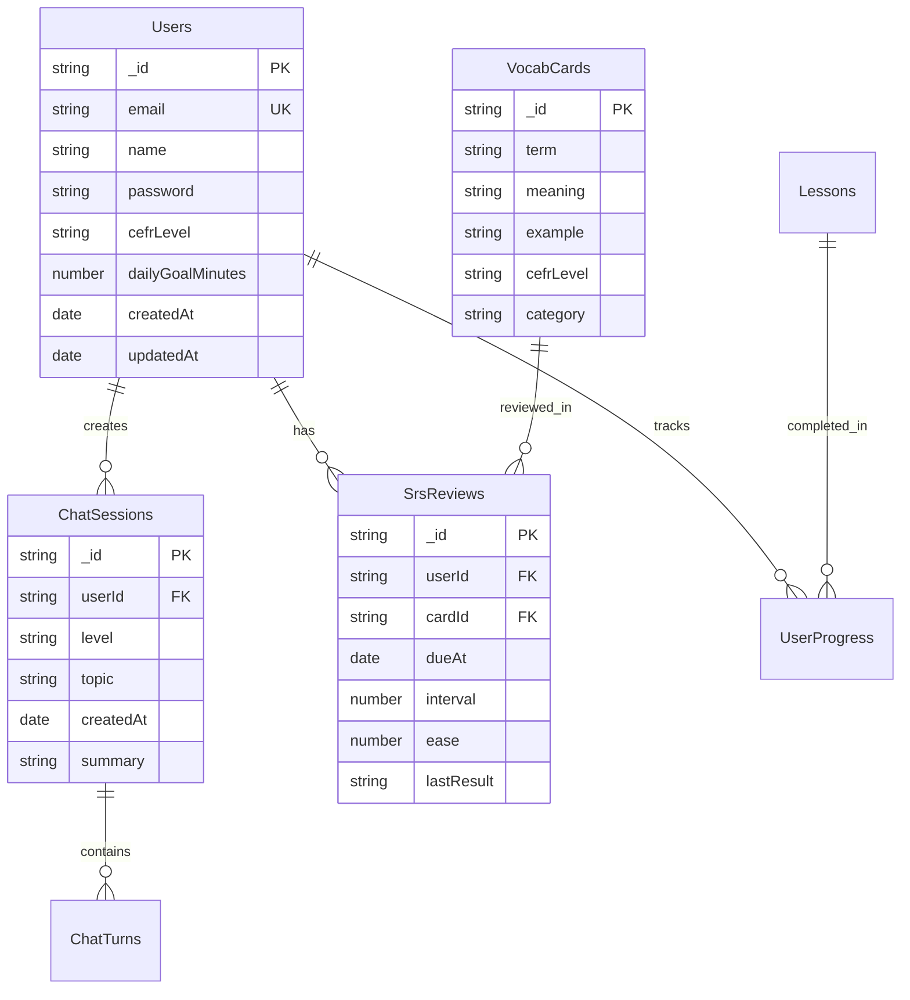

# 🗄️ Base de Dados

## 🎯 Visão Geral

O AI Linguo utiliza MongoDB como sistema de banco de dados principal, oferecendo flexibilidade para armazenar dados educacionais complexos e escalabilidade para crescimento futuro.

---

## 🏗️ Arquitetura do Banco de Dados

### 📊 **Visão Geral das Coleções**


---

## 👥 Coleção: Users

### 📋 **Schema Detalhado**
```javascript
{
  _id: "550e8400-e29b-41d4-a716-446655440000", // UUID v4
  email: "joao.silva@email.com",               // Unique index
  name: "João Silva",
  password: "$2b$10$N9qo8uLOickgx2ZMRZoMye...", // bcrypt hash
  cefrLevel: "B1",                             // enum: A1,A2,B1,B2,C1
  dailyGoalMinutes: 15,                        // Meta diária (padrão: 15)
  
  // Timestamps
  createdAt: ISODate("2024-01-15T10:30:00Z"),
  updatedAt: ISODate("2024-01-20T14:22:00Z"),
  
  // Campos calculados (via aggregation)
  streakDays: 5,              // Dias consecutivos estudando
  totalMinutes: 450,          // Total de minutos estudados
  lastStudyDate: ISODate("2024-01-20T14:00:00Z"),
  
  // Configurações do usuário
  preferences: {
    theme: "light",           // light | dark
    notifications: true,
    soundEffects: true,
    difficulty: "adaptive"    // adaptive | easy | challenging
  },
  
  // Métricas de progresso
  stats: {
    lessonsCompleted: 12,
    vocabularyMastered: 89,
    averageAccuracy: 0.82,
    totalChatMessages: 156
  }
}
```

### 🔍 **Índices Otimizados**
```javascript
// Índices para performance
db.users.createIndex({ email: 1 }, { unique: true });
db.users.createIndex({ createdAt: -1 });
db.users.createIndex({ cefrLevel: 1 });
db.users.createIndex({ lastStudyDate: -1 });

// Índice composto para queries de progresso
db.users.createIndex({ 
  cefrLevel: 1, 
  totalMinutes: -1, 
  streakDays: -1 
});
```

### 📊 **Queries Comuns**
```javascript
// Buscar usuário por email
db.users.findOne({ email: "joao@email.com" });

// Usuários mais ativos (leaderboard)
db.users.find({})
  .sort({ streakDays: -1, totalMinutes: -1 })
  .limit(10);

// Usuários por nível CEFR
db.users.aggregate([
  { $group: { _id: "$cefrLevel", count: { $sum: 1 } } },
  { $sort: { _id: 1 } }
]);

// Usuários que estudaram hoje
const today = new Date();
today.setHours(0, 0, 0, 0);

db.users.find({
  lastStudyDate: { $gte: today }
});
```

---

## 💬 Coleção: ChatSessions

### 📋 **Schema das Sessões**
```javascript
{
  _id: "session-uuid-here",
  userId: "user-uuid-here",              // FK para Users
  level: "B1",                           // Nível no momento da sessão
  topic: "daily_routine",                // general | grammar | vocabulary | custom
  
  // Metadados da sessão
  createdAt: ISODate("2024-01-20T10:00:00Z"),
  endedAt: ISODate("2024-01-20T10:25:00Z"),
  duration: 1500,                        // Duração em segundos
  
  // Resumo gerado por IA
  summary: "Usuário praticou past tense. Melhorou uso de verbos irregulares.",
  
  // Métricas da sessão
  messageCount: 12,                      // Total de mensagens
  correctionsCount: 4,                   // Total de correções feitas
  exercisesGenerated: 2,                 // Mini-exercícios criados
  
  // Análise de progresso
  progressMade: {
    grammarPoints: ["past_tense", "irregular_verbs"],
    vocabularyLearned: ["yesterday", "visited", "enjoyed"],
    improvements: ["verb_agreement", "time_expressions"]
  },
  
  // Status da sessão
  status: "completed"                    // active | completed | abandoned
}
```

### 🔍 **Índices para Chat Sessions**
```javascript
db.chatSessions.createIndex({ userId: 1, createdAt: -1 });
db.chatSessions.createIndex({ userId: 1, status: 1 });
db.chatSessions.createIndex({ topic: 1, level: 1 });
db.chatSessions.createIndex({ createdAt: -1 });
```

### 📊 **Queries de Análise**
```javascript
// Histórico de sessões do usuário
db.chatSessions.find({ userId: "user-id" })
  .sort({ createdAt: -1 })
  .limit(20);

// Tempo médio de sessão por nível
db.chatSessions.aggregate([
  { $match: { status: "completed" } },
  { $group: {
      _id: "$level",
      avgDuration: { $avg: "$duration" },
      totalSessions: { $sum: 1 }
    }
  }
]);

// Tópicos mais populares
db.chatSessions.aggregate([
  { $group: { _id: "$topic", count: { $sum: 1 } } },
  { $sort: { count: -1 } },
  { $limit: 10 }
]);
```

---

## 📝 Coleção: ChatTurns

### 📋 **Schema das Mensagens**
```javascript
{
  _id: "turn-uuid-here",
  sessionId: "session-uuid-here",        // FK para ChatSessions
  role: "user",                          // user | assistant
  
  // Conteúdo da mensagem
  text: "I go to school yesterday",
  
  // Correções (apenas para mensagens user)
  corrections: [
    {
      original: "I go",
      corrected: "I went",
      explanation: "Use past tense 'went' for yesterday",
      rule: "Past Simple Tense",
      severity: "high"                   // high | medium | low
    }
  ],
  
  // Mini-exercício (apenas para mensagens assistant)
  miniExercise: {
    question: "Complete: Yesterday I ___ to the store",
    options: ["go", "went", "going", "goes"],
    correct: 1,
    userAnswer: 1,                       // Index da resposta do usuário
    answeredCorrectly: true
  },
  
  // Metadados
  createdAt: ISODate("2024-01-20T10:15:00Z"),
  processingTime: 2.3,                   // Tempo de resposta da IA (segundos)
  tokensUsed: 145,                       // Tokens consumidos (OpenAI)
  
  // Análise automática
  analysis: {
    sentiment: "positive",               // positive | neutral | negative
    complexity: 0.3,                     // 0-1 (complexidade linguística)
    topics: ["daily_activities", "past_events"]
  }
}
```

### 🔍 **Índices para Mensagens**
```javascript
db.chatTurns.createIndex({ sessionId: 1, createdAt: 1 });
db.chatTurns.createIndex({ sessionId: 1, role: 1 });
db.chatTurns.createIndex({ createdAt: -1 });

// Índice para análise de correções
db.chatTurns.createIndex({ 
  "corrections.rule": 1, 
  createdAt: -1 
});
```

---

## 🎯 Coleção: VocabCards

### 📋 **Schema dos Flashcards**
```javascript
{
  _id: "card-uuid-here",
  
  // Conteúdo do card
  term: "beautiful",                     // Palavra/expressão em inglês
  meaning: "bonito/bonita",              // Significado em português
  example: "The sunset is beautiful",    // Frase exemplo
  
  // Classificação
  cefrLevel: "A2",                       // Nível CEFR
  category: "adjectives",                // adjectives | verbs | nouns | phrases
  subcategory: "appearance",             // Subcategoria específica
  
  // Metadados linguísticos
  partOfSpeech: "adjective",             // noun | verb | adjective | adverb
  difficulty: 0.4,                       // 0-1 (calculado por algoritmo)
  frequency: 850,                        // Frequência no inglês (rank)
  
  // Dados auxiliares
  phonetic: "/ˈbjuː.tɪ.fəl/",           // Transcrição fonética
  audio: "beautiful.mp3",                // Arquivo de áudio (opcional)
  
  // Contexto educacional
  relatedWords: ["pretty", "gorgeous", "lovely"],
  opposites: ["ugly", "hideous"],
  commonMistakes: [
    {
      mistake: "beautifull",
      correction: "beautiful",
      explanation: "Não duplicar o 'l' final"
    }
  ],
  
  // Metadados do sistema
  createdAt: ISODate("2024-01-10T00:00:00Z"),
  updatedAt: ISODate("2024-01-15T12:00:00Z"),
  source: "oxford_3000",                 // Fonte do vocabulário
  verified: true                         // Verificado por especialista
}
```

### 🔍 **Índices para Vocabulário**
```javascript
db.vocabCards.createIndex({ cefrLevel: 1, category: 1 });
db.vocabCards.createIndex({ term: 1 }, { unique: true });
db.vocabCards.createIndex({ difficulty: 1, frequency: 1 });
db.vocabCards.createIndex({ category: 1, subcategory: 1 });

// Índice de texto para busca
db.vocabCards.createIndex({ 
  term: "text", 
  meaning: "text", 
  example: "text" 
});
```

### 📊 **Queries de Vocabulário**
```javascript
// Cards por nível e categoria
db.vocabCards.find({ 
  cefrLevel: "B1", 
  category: "verbs" 
}).sort({ frequency: 1 });

// Busca por texto
db.vocabCards.find({ 
  $text: { $search: "family relatives" } 
});

// Cards por dificuldade
db.vocabCards.find({ 
  difficulty: { $gte: 0.3, $lte: 0.7 } 
}).sort({ frequency: 1 });
```

---

## 🔄 Coleção: SrsReviews

### 📋 **Schema do Sistema SRS**
```javascript
{
  _id: "review-uuid-here",
  userId: "user-uuid-here",              // FK para Users
  cardId: "card-uuid-here",              // FK para VocabCards
  
  // Algoritmo SRS
  dueAt: ISODate("2024-01-25T10:00:00Z"), // Quando revisar
  interval: 7,                           // Dias até próxima revisão
  ease: 2.1,                             // Fator de facilidade (1.3-2.5)
  repetitions: 3,                        // Número de repetições
  
  // Última revisão
  lastReviewedAt: ISODate("2024-01-18T15:30:00Z"),
  lastResult: "good",                    // again | hard | good | easy
  responseTime: 3.2,                     // Tempo de resposta (segundos)
  
  // Histórico de performance
  reviewHistory: [
    {
      date: ISODate("2024-01-15T10:00:00Z"),
      result: "hard",
      responseTime: 5.1
    },
    {
      date: ISODate("2024-01-18T15:30:00Z"),
      result: "good",
      responseTime: 3.2
    }
  ],
  
  // Métricas calculadas
  totalReviews: 5,
  correctReviews: 4,
  accuracy: 0.8,                         // Taxa de acerto
  averageResponseTime: 4.1,
  
  // Estado atual
  status: "learning",                    // new | learning | mature | suspended
  createdAt: ISODate("2024-01-10T12:00:00Z"),
  updatedAt: ISODate("2024-01-18T15:30:00Z")
}
```

### 🔍 **Índices para SRS**
```javascript
// Índice principal para revisões devidas
db.srsReviews.createIndex({ 
  userId: 1, 
  dueAt: 1, 
  status: 1 
});

// Índices para análise
db.srsReviews.createIndex({ userId: 1, cardId: 1 }, { unique: true });
db.srsReviews.createIndex({ userId: 1, accuracy: -1 });
db.srsReviews.createIndex({ cardId: 1, accuracy: -1 });
db.srsReviews.createIndex({ status: 1, updatedAt: -1 });
```

### 📊 **Queries do SRS**
```javascript
// Cards devidos para revisão
const now = new Date();
db.srsReviews.find({
  userId: "user-id",
  dueAt: { $lte: now },
  status: { $in: ["learning", "mature"] }
}).sort({ dueAt: 1 }).limit(20);

// Estatísticas de aprendizado
db.srsReviews.aggregate([
  { $match: { userId: "user-id" } },
  { $group: {
      _id: "$status",
      count: { $sum: 1 },
      avgAccuracy: { $avg: "$accuracy" },
      avgEase: { $avg: "$ease" }
    }
  }
]);

// Cards mais difíceis (baixa accuracy)
db.srsReviews.find({ 
  userId: "user-id",
  totalReviews: { $gte: 3 },
  accuracy: { $lt: 0.6 }
}).sort({ accuracy: 1 });
```

---

## 📚 Coleção: Lessons

### 📋 **Schema das Lições**
```javascript
{
  _id: "lesson-uuid-here",
  
  // Metadados da lição
  title: "Present Perfect vs Past Simple",
  description: "Learn when to use each tense correctly",
  cefrLevel: "B1",
  
  // Conteúdo estruturado
  contentMarkdown: `# Present Perfect vs Past Simple
  
## When to use Present Perfect
- Actions that happened at an unspecified time
- Actions that started in the past and continue now
- Recent actions with current relevance

## Examples
- I have lived here for 10 years
- She has just arrived
- Have you seen this movie?`,
  
  // Estrutura da lição
  sections: [
    {
      type: "explanation",
      title: "Grammar Rule",
      content: "Present Perfect connects past and present..."
    },
    {
      type: "examples",
      title: "Common Uses", 
      items: ["I have been", "She has done", "We have seen"]
    },
    {
      type: "exercise",
      title: "Practice",
      questions: [
        {
          question: "I ___ this book last week",
          options: ["read", "have read"],
          correct: 0,
          explanation: "Use past simple for specific time"
        }
      ]
    }
  ],
  
  // Configurações
  estimatedMinutes: 25,
  difficulty: 0.6,                       // 0-1
  prerequisites: ["past_simple_basics"],
  learningObjectives: [
    "Distinguish present perfect from past simple",
    "Use time markers correctly",
    "Apply rules in conversation"
  ],
  
  // Recursos
  vocabulary: ["already", "just", "never", "ever", "since", "for"],
  grammar: ["present_perfect", "past_simple", "time_expressions"],
  
  // Metadados do sistema
  createdAt: ISODate("2024-01-01T00:00:00Z"),
  updatedAt: ISODate("2024-01-10T12:00:00Z"),
  author: "sistema",
  version: 1.2,
  published: true
}
```

---

## 📈 Coleção: UserProgress

### 📋 **Schema do Progresso**
```javascript
{
  _id: "progress-uuid-here",
  userId: "user-uuid-here",
  lessonId: "lesson-uuid-here",
  
  // Status da lição
  status: "completed",                   // not_started | in_progress | completed
  startedAt: ISODate("2024-01-20T10:00:00Z"),
  completedAt: ISODate("2024-01-20T10:25:00Z"),
  timeSpent: 1500,                       // Segundos
  
  // Performance
  score: 0.85,                           // 0-1
  exercisesCompleted: 8,
  exercisesTotal: 10,
  correctAnswers: 7,
  
  // Detalhes das respostas
  exerciseResults: [
    {
      questionId: 1,
      userAnswer: "read",
      correctAnswer: "read", 
      correct: true,
      timeSpent: 12.3
    }
  ],
  
  // Análise de aprendizado
  strugglingConcepts: ["time_markers"],
  masteredConcepts: ["present_perfect_form"],
  recommendedReview: ["past_simple_review"],
  
  updatedAt: ISODate("2024-01-20T10:25:00Z")
}
```

---

## 🔧 Operações e Manutenção

### 📊 **Scripts de Agregação Úteis**
```javascript
// Dashboard de estatísticas gerais
db.users.aggregate([
  {
    $lookup: {
      from: "chatSessions",
      localField: "_id",
      foreignField: "userId", 
      as: "sessions"
    }
  },
  {
    $addFields: {
      totalSessions: { $size: "$sessions" },
      totalMinutes: { $sum: "$sessions.duration" }
    }
  },
  {
    $group: {
      _id: null,
      totalUsers: { $sum: 1 },
      activeUsers: { 
        $sum: { 
          $cond: [{ $gt: ["$totalSessions", 0] }, 1, 0] 
        }
      },
      avgSessionsPerUser: { $avg: "$totalSessions" },
      totalStudyTime: { $sum: "$totalMinutes" }
    }
  }
]);

// Relatório de progresso por nível CEFR
db.srsReviews.aggregate([
  {
    $lookup: {
      from: "users",
      localField: "userId",
      foreignField: "_id",
      as: "user"
    }
  },
  { $unwind: "$user" },
  {
    $group: {
      _id: "$user.cefrLevel",
      avgAccuracy: { $avg: "$accuracy" },
      totalReviews: { $sum: "$totalReviews" },
      masteredCards: {
        $sum: { 
          $cond: [{ $gt: ["$accuracy", 0.8] }, 1, 0] 
        }
      }
    }
  }
]);
```

### 🗂️ **Backup e Restore**
```bash
# Backup completo
mongodump --db ailinguo --out /backup/$(date +%Y%m%d)

# Backup de coleção específica
mongodump --db ailinguo --collection users --out /backup/users

# Restore
mongorestore --db ailinguo /backup/20240120/ailinguo/

# Backup incremental (apenas documentos modificados hoje)
mongoexport --db ailinguo --collection users \
  --query '{"updatedAt": {"$gte": {"$date": "'$(date -u +%Y-%m-%d)'T00:00:00.000Z"}}}' \
  --out users_incremental.json
```

### 🔧 **Manutenção de Índices**
```javascript
// Analisar performance de queries
db.users.explain("executionStats").find({ email: "test@email.com" });

// Reconstruir índices
db.users.reIndex();

// Estatísticas de uso de índices
db.users.aggregate([{ $indexStats: {} }]);

// Remover índices não utilizados
db.runCommand({ dropIndexes: "users", index: "unused_index_name" });
```

### 📊 **Monitoramento de Performance**
```javascript
// Queries mais lentas
db.runCommand({ profile: 2, slowms: 100 });
db.system.profile.find().sort({ ms: -1 }).limit(5);

// Estatísticas da coleção
db.users.stats();
db.chatSessions.stats();

// Uso de memória
db.serverStatus().mem;

// Conexões ativas
db.serverStatus().connections;
```

Esta estrutura de banco de dados garante performance, escalabilidade e flexibilidade para suportar todas as funcionalidades educacionais do AI Linguo.