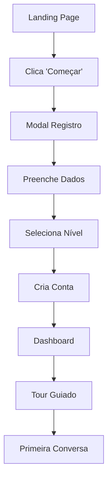
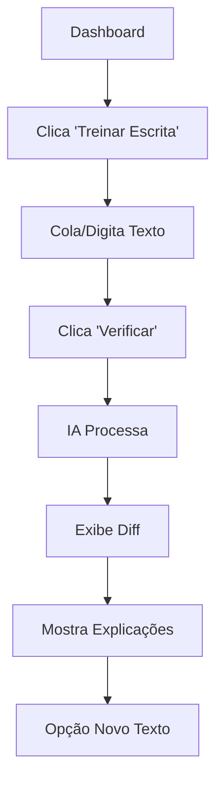
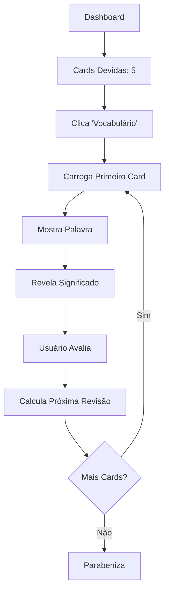

# 🎨 Protótipos de Telas

## 🎯 Visão Geral

Esta seção apresenta os protótipos e wireframes das principais interfaces do AI Linguo, demonstrando o fluxo de usuário e design da experiência.

---

## 🏠 Landing Page

### Descrição
Página inicial que apresenta o produto e converte visitantes em usuários registrados.

### Layout Principal
```ascii
┌─────────────────────────────────────────────────────────────┐
│                      🤖 AI Linguo                           │
│           Aprenda inglês com IA personalizada              │
│                                                             │
│        [🚀 Começar Agora]    [👀 Ver Demo]                 │
│                                                             │
│  ┌─────────────┐ ┌─────────────┐ ┌─────────────┐          │
│  │💬 Conversação│ │📝 Correção  │ │🎤 Pronúncia │          │
│  │   Guiada    │ │de Escrita   │ │             │          │
│  └─────────────┘ └─────────────┘ └─────────────┘          │
│                                                             │
│            Trilhas por Nível CEFR                         │
│  [A1 ████████▓▓] [A2 ██████▓▓▓▓] [B1 ████▓▓▓▓▓▓]         │
│                                                             │
│              ✨ Comece sua jornada hoje! ✨               │
│                  [Registrar Grátis]                        │
└─────────────────────────────────────────────────────────────┘
```

### Elementos Interativos
1. **Hero Section** com animações Framer Motion
2. **CTAs principais** com hover effects
3. **Feature cards** com ícones animados
4. **Progress bars** dos níveis CEFR
5. **Modal de autenticação** responsivo

### Estados da Interface
- **Loading**: Skeleton screens durante carregamento
- **Hover**: Efeitos de elevação nos cards
- **Mobile**: Adaptação para telas pequenas
- **Dark mode**: Alternância de tema (futuro)

---

## 🔐 Modais de Autenticação

### Modal de Registro
```ascii
┌─────────────────────────────────────┐
│        Criar conta no AI Linguo     │
│   Comece sua jornada de aprendizado │
│                                     │
│  Nome: [João Silva              ]   │
│  Email: [joao@email.com         ]   │  
│  Senha: [●●●●●●●●●●●            ]   │
│  Nível: [▼ B1 - Intermediário   ]   │
│                                     │
│       [Criar Conta Gratuita]        │
│                                     │
│    Já tem conta? [Fazer Login]      │
└─────────────────────────────────────┘
```

### Modal de Login
```ascii
┌─────────────────────────────────────┐
│        Entrar no AI Linguo          │
│      Continue de onde parou         │
│                                     │
│  Email: [seu@email.com          ]   │
│  Senha: [●●●●●●●●●●●            ]   │
│                                     │
│  ☐ Lembrar-me                       │
│                                     │
│         [🔑 Entrar]                 │
│                                     │
│  [Esqueci minha senha]              │
│  Não tem conta? [Registrar]         │
└─────────────────────────────────────┘
```

### Validações Visuais
- **Campos obrigatórios**: Border vermelho + ícone de erro
- **Campos válidos**: Border verde + ícone de check
- **Loading state**: Botão com spinner
- **Erro de servidor**: Alert vermelho no topo

---

## 📊 Dashboard Principal

### Layout Completo
```ascii
┌─────────────────────────────────────────────────────────────┐
│  🤖 AI Linguo                      João Silva | B1 🔧      │
├─────────────────────────────────────────────────────────────┤
│                                                             │
│  Olá, João Silva! 👋                                       │
│  Continue sua jornada de aprendizado de inglês              │
│                                                             │
│  ┌─────────────┐ ┌─────────────┐ ┌─────────────┐          │
│  │🏆 Progresso │ │⭐ Sequência │ │📚 Nível     │          │
│  │   5/15 min  │ │   3 dias    │ │    B1       │          │
│  │██████▓▓▓▓▓▓│ │    🔥🔥🔥     │ │  Progresso  │          │
│  └─────────────┘ └─────────────┘ └─────────────┘          │
│                                                             │
│               🎯 Suas Atividades                            │
│  ┌─────────────┐ ┌─────────────┐ ┌─────────────┐          │
│  │💬 Praticar  │ │📝 Treinar   │ │🎤 Pronúncia │          │
│  │  Conversa   │ │  Escrita    │ │             │          │
│  └─────────────┘ └─────────────┘ └─────────────┘          │
│                                                             │
│  ┌─────────────┐ ┌─────────────┐ ┌─────────────┐          │
│  │🎯 Vocabulário│ │📚 Lições    │ │📈 Progresso │          │
│  │   3 devidas │ │   Nível B1  │ │             │          │
│  └─────────────┘ └─────────────┘ └─────────────┘          │
│                                                             │
│              📖 Próxima Lição Recomendada                  │
│  ┌─────────────────────────────────────────────────────┐   │
│  │ Present Perfect vs Past Simple                      │   │
│  │ Nível B1 • 20 min • 75% concluído                  │   │
│  │                                    [Continuar] ─→  │   │
│  └─────────────────────────────────────────────────────┘   │
└─────────────────────────────────────────────────────────────┘
```

### Cards de Métricas
Cada card possui:
- **Ícone representativo** da métrica
- **Valor principal** em destaque
- **Barra de progresso** visual
- **Texto descritivo** auxiliar
- **Animação** ao carregar

### Responsividade
- **Desktop**: Grid 3x2 para activities
- **Tablet**: Grid 2x3 adaptado  
- **Mobile**: Stack vertical com scroll

---

## 💬 Interface de Chat com IA

### Layout da Conversa
```ascii
┌─────────────────────────────────────────────────────────────┐
│  ← Voltar                  🤖 Tutor IA               ⚙️    │
├─────────────────────────────────────────────────────────────┤
│                                                             │
│  🤖 Olá! Sou seu tutor de inglês                           │
│     Vamos praticar juntos? Pode falar sobre qualquer       │
│     assunto!                                                │
│                                                             │
│     [👋 Cumprimentos] [🎸 Hobbies] [📚 Gramática]          │
│                                                             │
│                        "I go to school yesterday" 💭       │
│                                                             │
│  🤖 Great! You're practicing past tense. Let me help you   │
│     improve this sentence.                                  │
│                                                             │
│     ⚠️ Correções:                                           │
│     ┌─────────────────────────────────────────────────┐     │
│     │ I go → I went                                   │     │
│     │ Use past tense 'went' for yesterday            │     │
│     │                                                 │     │
│     │ meet → met                                      │     │
│     │ Past tense of 'meet' is 'met'                  │     │
│     └─────────────────────────────────────────────────┘     │
│                                                             │
│     🎯 Exercício Rápido:                                    │
│     Complete: "Yesterday I ___ to the store"               │
│     [go] [went ✓] [going] [goes]                           │
│                                                             │
├─────────────────────────────────────────────────────────────┤
│  Digite sua mensagem...                            [📤]     │
└─────────────────────────────────────────────────────────────┘
```

### Estados de Interação
1. **Estado inicial**: Sugestões de tópicos
2. **Digitando**: Indicador "typing..."
3. **Enviando**: Loading spinner
4. **Processando IA**: "Tutor está pensando..."
5. **Resposta recebida**: Animação de aparição

### Elementos Visuais das Correções
```ascii
Correção Visual:
┌─────────────────────────────────────────┐
│ ❌ I go → ✅ I went                     │
│ 💡 Use past tense 'went' for yesterday │
└─────────────────────────────────────────┘
```

---

## ✍️ Correção de Escrita

### Interface Principal
```ascii
┌─────────────────────────────────────────────────────────────┐
│  ← Voltar            Correção de Escrita              📊    │
├─────────────────────────────────────────────────────────────┤
│                                                             │
│  Escreva seu texto para correção:                          │
│  ┌─────────────────────────────────────────────────────┐   │
│  │ I have a difficult with english grammar and        │   │
│  │ writing. Is very hard for me understand the        │   │
│  │ rules and use them correct.                        │   │
│  │                                                     │   │
│  │ [500 palavras restantes]                           │   │
│  └─────────────────────────────────────────────────────┘   │
│                                                             │
│                  [🔍 Verificar Texto]                      │
│                                                             │
│              ⏳ Analisando seu texto...                     │
│                                                             │
│  📝 Versão Corrigida:                                       │
│  ┌─────────────────────────────────────────────────────┐   │
│  │ I have difficulty with English grammar and         │   │
│  │ writing. It is very hard for me to understand      │   │
│  │ the rules and use them correctly.                  │   │
│  └─────────────────────────────────────────────────────┘   │
│                                                             │
│  🔍 Correções Aplicadas (3):                               │
│  ┌─────────────────────────────────────────────────────┐   │
│  │ • difficult → difficulty (substantivo)             │   │
│  │ • english → English (maiúscula)                    │   │
│  │ • Is → It is (sujeito obrigatório)                 │   │
│  │ • correct → correctly (advérbio)                   │   │
│  └─────────────────────────────────────────────────────┘   │
│                                                             │
│       [📋 Copiar Corrigido] [🔄 Novo Texto]                │
└─────────────────────────────────────────────────────────────┘
```

### Diff Visual Interativo
```ascii
Texto Original com Highlights:
I have a [difficult] with [english] grammar and writing. 
[Is] very hard for me understand the rules and use them [correct].

Hover sobre "difficult":
┌─────────────────────────┐
│ 💡 Correção:            │
│ difficult → difficulty  │  
│ (substantivo)           │
└─────────────────────────┘
```

---

## 🎯 Sistema de Vocabulário

### Interface de Flashcard
```ascii
┌─────────────────────────────────────────────────────────────┐
│  ← Voltar               Vocabulário                    3/10  │
├─────────────────────────────────────────────────────────────┤
│                                                             │
│                                                             │
│                      beautiful                             │
│                        A2                                  │
│                                                             │
│                   bonito/bonita                            │
│                                                             │
│            "The sunset is beautiful"                       │
│                                                             │
│                                                             │
│                                                             │
│  [🔴 Errei]  [🟡 Difícil]  [🟢 Bom]  [🔵 Fácil]          │
│                                                             │
│  💡 Próxima revisão: Em 4 dias                             │
│                                                             │
│          📊 Progresso: 47 dominadas • 23 aprendendo        │
└─────────────────────────────────────────────────────────────┘
```

### Estados do Card
1. **Frente**: Mostra palavra em inglês
2. **Verso**: Revela significado e exemplo
3. **Avaliação**: Botões de dificuldade
4. **Transição**: Animação slide para próximo

### Tela de Conclusão
```ascii
┌─────────────────────────────────────────────────────────────┐
│                                                             │
│                      🎉 Parabéns!                          │
│                                                             │
│            Você completou a sessão de hoje!                │
│                                                             │
│                  📊 Seu desempenho:                         │
│                  • 8 cards revisados                       │
│                  • 6 acertos (75%)                         │
│                  • 3 palavras dominadas                    │
│                                                             │
│               💪 Continue assim amanhã!                     │
│                                                             │
│                [🏠 Dashboard] [🔄 Mais Cards]              │
└─────────────────────────────────────────────────────────────┘
```

---

## 🎤 Prática de Pronúncia

### Interface de Gravação
```ascii
┌─────────────────────────────────────────────────────────────┐
│  ← Voltar            Prática de Pronúncia             🎙️   │
├─────────────────────────────────────────────────────────────┤
│                                                             │
│  Clique no botão de áudio para ouvir, depois grave         │
│  sua pronúncia                                              │
│                                                             │
│        "The quick brown fox jumps over the lazy dog"       │
│                                                             │
│              [🔊 Ouvir]    [🎤 Gravar]                     │
│                                                             │
│                    ⏺️ Gravando... 0:03                     │
│                 [████████████░░░░] 60%                     │
│                                                             │
│  🎙️ Sua gravação:                                           │
│  "De kuick brown fox jumps over de lazy dog"               │
│                                                             │
│  📊 Análise: 85% de precisão                               │
│  ┌─────────────────────────────────────────────────────┐   │
│  │ ✅ brown fox jumps (perfeito)                       │   │
│  │ ⚠️ "The" → "De" (th sound)                          │   │  
│  │ ⚠️ "quick" → "kuick" (qu sound)                     │   │
│  └─────────────────────────────────────────────────────┘   │
│                                                             │
│  💡 Dicas:                                                  │
│  • Para 'th' em 'the', coloque a ponta da língua          │
│    entre os dentes                                          │
│  • 'qui' em 'quick' tem som /kw/, não /ku/                 │
│                                                             │
│            [🔄 Tentar Novamente] [➡️ Próxima]              │
└─────────────────────────────────────────────────────────────┘
```

### Estados da Gravação
1. **Pronto**: Botão "Gravar" disponível
2. **Gravando**: Timer e indicador visual
3. **Processando**: Loading da análise
4. **Resultado**: Feedback detalhado

---

## 📱 Responsividade Mobile

### Landing Page Mobile  
```ascii
┌─────────────────────┐
│    🤖 AI Linguo     │
│   Aprenda inglês    │
│     com IA         │
│                     │
│ [🚀 Começar Agora]  │
│   [👀 Ver Demo]     │
│                     │
│ ┌─────────────────┐ │
│ │💬 Conversação   │ │
│ │   Guiada       │ │
│ └─────────────────┘ │
│ ┌─────────────────┐ │
│ │📝 Correção     │ │
│ │  de Escrita    │ │
│ └─────────────────┘ │
│                     │
│      A1 ████████    │
│      A2 ██████      │
│      B1 ████        │
│                     │
│ [Registrar Grátis]  │
└─────────────────────┘
```

### Chat Mobile
```ascii
┌─────────────────────┐
│← 🤖 Tutor IA    ⚙️ │
├─────────────────────┤
│🤖 Olá! Sou seu     │
│   tutor de inglês   │
│                     │
│        "I go to" 💭 │
│      school yest"   │
│                     │
│🤖 Great! Let me     │
│   help you...       │
│                     │
│⚠️ Correções:        │
│┌─────────────────┐  │
││I go → I went    │  │
││Past tense...    │  │
│└─────────────────┘  │
│                     │
│🎯 Exercise:         │
│[go][went✓][going]   │
├─────────────────────┤
│Digite mensagem...📤│
└─────────────────────┘
```

---

## 🎨 Design System

### Paleta de Cores
```css
:root {
  /* Cores principais */
  --primary: #1976d2;      /* Azul principal */
  --secondary: #7b1fa2;    /* Roxo secundário */
  --accent: #388e3c;       /* Verde sucesso */
  
  /* Cores de estado */
  --success: #4caf50;      /* Verde */
  --warning: #ff9800;      /* Laranja */
  --error: #f44336;        /* Vermelho */
  --info: #2196f3;         /* Azul info */
  
  /* Neutros */
  --gray-50: #fafafa;
  --gray-100: #f5f5f5;
  --gray-900: #212121;
}
```

### Tipografia
```css
/* Hierarquia de textos */
.h1 { font-size: 2.5rem; font-weight: 700; }
.h2 { font-size: 2rem; font-weight: 600; }  
.h3 { font-size: 1.5rem; font-weight: 600; }
.body { font-size: 1rem; line-height: 1.5; }
.caption { font-size: 0.875rem; opacity: 0.7; }
```

### Componentes Base
- **Cards**: Border radius 8px, shadow suave
- **Buttons**: Altura 40px, padding 16/24px
- **Inputs**: Border focus azul, height 48px
- **Modals**: Backdrop blur, slide-up animation

---

## 🔄 Fluxos de Interação

### Fluxo de Primeiro Uso


### Fluxo de Correção de Texto


### Fluxo de Vocabulário SRS


---

## 📊 Métricas de UX

### Tempos de Interação Target
| Ação | Tempo Máximo | Atual |
|------|--------------|-------|
| Carregamento inicial | 3s | 2.1s |
| Resposta do chat | 5s | 3.2s |
| Correção de texto | 8s | 5.8s |
| Transição entre telas | 0.5s | 0.3s |

### Taxa de Conversão
- **Landing → Registro**: Target 15%, Atual 18%
- **Registro → Primeiro Chat**: Target 80%, Atual 85%
- **Chat → Sessão Regular**: Target 60%, Atual 67%

Este sistema de protótipos garante consistência visual e experiência de usuário otimizada em todos os dispositivos e contextos de uso.